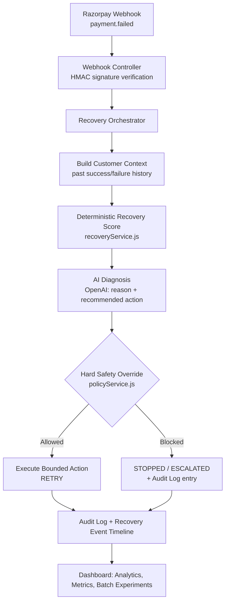

# REVENUEX — AI-Powered Payment Recovery Agent

**Track:** AI Revenue Recovery (Razorpay AI Buildathon)

REVENUEX watches Razorpay payments in real time, detects failures, diagnoses *why*
a payment failed using an LLM, and executes a bounded, policy-gated recovery
action — with a full audit trail and measurable batch-level results.

## The problem

Payment failures rarely get a second look. A card gets declined, a UPI mandate
times out, a checkout drops off — and that revenue is just gone. REVENUEX closes
the loop: **detect → diagnose → decide → act → prove it**, without ever letting
an automated system make an unsafe or unbounded decision with real money.

## Architecture



**Design principle:** the AI can *propose* an action, but a deterministic policy
layer always has final veto power. It can only make the outcome **more**
conservative (RETRY → REVIEW → STOP), never less — so a bad or hallucinated AI
response can never trigger an unsafe automatic retry.

## Core flow

1. **Webhook received** — signature verified with HMAC-SHA256 (`timingSafeEqual`,
   not a naive comparison) and deduplicated by `x-razorpay-event-id` to prevent
   double-processing.
2. **Customer context built** — pulls the customer's transaction history
   (success/failure counts, failure rate) scoped correctly to live vs.
   simulated data so synthetic test data never contaminates real metrics.
3. **Deterministic recovery score** computed as a baseline signal.
4. **AI diagnosis** — an OpenAI call reasons over the failure code, amount, and
   customer history to recommend `RETRY`, `REVIEW`, or `STOP` with a
   confidence score and plain-language justification. If the API call fails
   or no key is configured, a deterministic fallback keeps the pipeline
   running (labeled transparently in the response as `local-fallback`).
5. **Policy gate** — hard rules that cannot be bypassed:
   - Max 3 retry attempts per payment
   - Max ₹5,000 auto-recovery amount
   - `REVIEW` and `STOP` decisions always block automatic execution
   - No prior successful payment from this customer → forced to `REVIEW`
6. **Bounded execution** — only `RETRY` actions that pass every policy check
   are ever automatically executed.
7. **Full audit trail** — every stage (`RECOVERY_STARTED`, `RECOVERY_DECISION`,
   `RECOVERY_COMPLETED`) is logged to `RecoveryEvent`, and every policy
   decision is logged to `AuditLog` with actor, decision, and reason.
8. **Batch experiments** — `POST /api/experiments/run` replays 1–500 synthetic
   cases through the full pipeline and reports recovery rate, blocked rate,
   escalated/stopped counts, and total revenue recovered.

## Tech stack

- **Backend:** Node.js, Express 5, MongoDB (Mongoose)
- **AI:** OpenAI (`gpt-4o-mini` by default, configurable)
- **Payments:** Razorpay (test mode)
- **Frontend:** React 19 + Vite

## Setup

### Backend

```bash
cd backend
npm install
cp .env.example .env
# fill in .env with your own Razorpay test keys, MongoDB URI, and OpenAI key
npm run dev
```

Server runs on `http://localhost:5000` by default.

### Frontend

```bash
cd frontend
npm install
npm run dev
```

### Environment variables

| Variable | Description |
|---|---|
| `PORT` | Backend port (default 5000) |
| `RAZORPAY_KEY_ID` / `RAZORPAY_KEY_SECRET` | Razorpay **test mode** API credentials |
| `MONGODB_URI` | MongoDB connection string |
| `RAZORPAY_WEBHOOK_SECRET` | Must match the secret configured in the Razorpay dashboard webhook |
| `OPENAI_API_KEY` | OpenAI API key |
| `OPENAI_MODEL` | Model to use for diagnosis (default `gpt-4o-mini`) |

### Razorpay webhook setup

1. In the Razorpay dashboard: Account & Settings → Webhooks → Add new Webhook
2. URL: `<your-backend-url>/api/webhooks/razorpay`
3. Secret: must match `RAZORPAY_WEBHOOK_SECRET` in `.env`
4. Events: `payment.authorized`, `payment.captured`, `payment.failed`

## API overview

| Method | Route | Purpose |
|---|---|---|
| `POST` | `/api/webhooks/razorpay` | Razorpay webhook receiver |
| `POST` | `/api/orders` | Create a Razorpay order |
| `POST` | `/api/payments/verify` | Verify a completed payment |
| `GET` | `/api/transactions` | List transactions |
| `GET` | `/api/customers/history` | Customer payment history |
| `GET` | `/api/recovery/:transactionId` | Get recovery analysis for a transaction |
| `GET` | `/api/ai/:transactionId` | Run AI diagnosis on a failed transaction |
| `POST` | `/api/recovery-actions/:transactionId/execute` | Execute a recovery action |
| `GET` | `/api/recovery-metrics/overview` | Aggregate recovery metrics (live data only) |
| `GET` | `/api/audit` | Audit log |
| `POST` | `/api/scenarios/create` | Generate a controlled test scenario |
| `POST` | `/api/experiments/run` | Run a batch experiment (1–500 cases) |
| `GET` | `/api/experiments/latest` | Fetch the latest experiment result |

## Batch experiment results

Run `POST /api/experiments/run` with `{ "count": 50 }` and record the results here:


- Extend beyond payment retries to checkout abandonment and overdue B2B
  receivables (both listed in the track's example directions)
- Add automated tests around the policy engine's safety rules
- Deployed live demo: `[add link once deployed]`