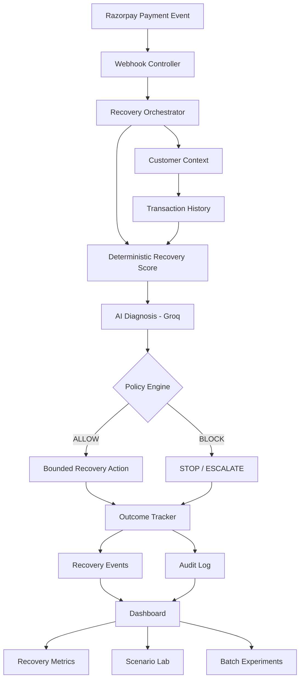

# REVENUEX — Autonomous AI Revenue Recovery Agent

### AI Revenue Recovery · Razorpay AI Buildathon

**REVENUEX** is an autonomous AI-powered payment recovery system that helps businesses recover revenue lost to failed payments.

Instead of simply detecting that a payment failed, REVENUEX asks:

> **Why did it fail? Should we try again? Is this customer worth recovering? Is retrying financially safe? And when should we stop?**

It combines **customer payment history, deterministic recovery scoring, LLM-based reasoning, financial safety policies, bounded execution, and a complete audit trail** into one recovery loop.

**Detect → Understand → Decide → Validate → Recover → Learn**

---

## Why REVENUEX?

Payment failure is not the end of a transaction.

A card can temporarily fail. A UPI payment can encounter a transient issue. A customer may have successfully paid multiple times in the past but experience one isolated failure.

At the same time, blindly retrying every failed payment is a bad idea.

It can:

* waste payment attempts
* repeatedly charge customers
* create poor customer experiences
* increase operational noise
* retry payments that should never be retried
* create unnecessary financial risk

Most basic payment systems stop at:

```text
Payment Failed
        ↓
Show Failure
```

REVENUEX closes the loop:

```text
Payment Failed
      ↓
Understand the failure
      ↓
Build customer context
      ↓
Estimate recovery potential
      ↓
Ask AI for a recovery recommendation
      ↓
Validate recommendation against hard policies
      ↓
Execute only if it is safe
      ↓
Record exactly what happened
```

The goal is not to make the AI as aggressive as possible.

The goal is to make it **useful, measurable, and financially safe**.

---

# What REVENUEX Does

REVENUEX acts as a bounded recovery agent around failed payments.

For every failed transaction, it can:

1. **Detect** the failed payment
2. **Understand** the failure context
3. **Build customer history**
4. **Calculate a deterministic recovery score**
5. **Ask an AI model to reason about the case**
6. **Recommend RETRY, REVIEW, or STOP**
7. **Run the recommendation through deterministic financial policies**
8. **Execute a bounded recovery action when permitted**
9. **Escalate or stop when recovery should not continue**
10. **Record the entire decision trail**
11. **Measure recovery performance across controlled experiments**

---

# The Core Idea

The most important design decision in REVENUEX is the separation between **AI intelligence** and **financial authorization**.

### AI decides what it recommends.

### The policy engine decides what is allowed.

### The recovery engine executes only what the policy engine permits.

In other words:

```text
                ┌──────────────────┐
                │      AI Agent    │
                │                  │
                │ Understands case │
                │ Recommends action│
                └────────┬─────────┘
                         │
                         ▼
                ┌──────────────────┐
                │  Policy Engine   │
                │                  │
                │ Hard constraints │
                │ Safety checks    │
                │ Retry limits     │
                │ Amount limits    │
                └────────┬─────────┘
                         │
                  ALLOW / BLOCK
                         │
                         ▼
                ┌──────────────────┐
                │ Recovery Engine  │
                │                  │
                │ Bounded execution│
                └──────────────────┘
```

This means an LLM cannot directly authorize a financial action.

Even if the AI produces an unsafe, unexpected, or hallucinated recommendation, the deterministic policy layer can stop it.

---

# Architecture



---

# Recovery Decision Pipeline

REVENUEX follows a structured pipeline rather than allowing an LLM to control the entire process.

## 1. Detect

A payment failure enters the system through the payment pipeline.

The backend records the transaction and makes it available for recovery analysis.

---

## 2. Build Customer Context

The system looks at the customer's previous payment behavior.

Relevant signals include:

* successful payments
* failed payments
* failure rate
* payment method
* failure reason
* retry count
* transaction amount
* simulation/live context

Customer history is scoped correctly so that controlled synthetic experiments do not contaminate live revenue analytics.

---

## 3. Calculate Recovery Score

Before asking the AI to make a recommendation, REVENUEX calculates a deterministic recovery propensity score.

The score considers factors such as:

* previous successful payments
* historical failures
* failure rate
* failure type
* retry exposure
* transaction amount
* available sample size
* repeated failure patterns

The result provides a consistent baseline signal.

Example:

```text
Recovery Score: 82
Risk Level: LOW
Baseline Action: RETRY
```

The score is **not** an authorization mechanism.

It is a structured signal used alongside AI reasoning and deterministic policy checks.

---

# 4. AI Diagnosis

REVENUEX uses **Groq** through its OpenAI-compatible API interface.

The AI receives structured payment context rather than unrestricted access to the system.

It evaluates information such as:

```text
Payment amount
Payment method
Failure reason
Retry count
Successful payment history
Failed payment history
Recovery score
Risk level
```

The AI produces a constrained recommendation:

```text
RETRY
REVIEW
STOP
```

along with:

* confidence
* reasoning
* failure interpretation
* recommended recovery action

The AI is advisory.

It does **not** directly execute payment actions.

---

# 5. Deterministic Policy Gate

Every AI recommendation passes through the policy engine.

Current safety policies include:

### Maximum retry exposure

A payment cannot automatically retry beyond the configured retry limit.

```text
Maximum retries = 3
```

### Automatic recovery amount limit

Automatic recovery is restricted to payments up to:

```text
₹5,000
```

### AI REVIEW decision

If the AI recommends:

```text
REVIEW
```

automatic execution is blocked and the case is escalated for review.

### AI STOP decision

If the AI recommends:

```text
STOP
```

automatic execution is blocked.

### No successful customer history

If a customer has no prior successful payment history, the system becomes more conservative and routes the case toward review.

### High-risk conditions

Certain conditions force a conservative outcome regardless of the AI recommendation, including:

* repeated failures
* excessive retry exposure
* high-value transactions
* absence of successful customer history

---

# 6. Bounded Recovery

Only a policy-approved `RETRY` can reach the recovery engine.

The recovery engine performs additional validation before execution.

This creates multiple safety boundaries:

```text
AI Recommendation
       ↓
Policy Validation
       ↓
Execution Validation
       ↓
Atomic Recovery Claim
       ↓
Recovery Action
```

The system therefore does not treat an AI response as permission to move money.

---

# 7. Stop and Escalate

A good recovery system must know when **not** to recover.

REVENUEX explicitly supports:

```text
RETRY
REVIEW
STOP
```

This is important because maximizing retries is not the same as maximizing revenue.

For example:

```text
₹75,000 payment
+
3 previous retries
+
repeated failure
```

should not become:

```text
AI says RETRY
        ↓
Retry anyway
```

Instead:

```text
High-risk case
      ↓
Policy blocks recovery
      ↓
STOP / ESCALATE
      ↓
Audit trail
```

---

# AI Safety Architecture

REVENUEX uses a **defense-in-depth** approach.

The AI is intentionally constrained.

### Layer 1 — Structured input

The AI receives relevant transaction and customer context.

### Layer 2 — Constrained output

The model is expected to return one of:

```text
RETRY
REVIEW
STOP
```

### Layer 3 — Hard safety overrides

Certain conditions can override an AI recommendation.

### Layer 4 — Deterministic policy

The policy engine independently validates the recommendation.

### Layer 5 — Bounded execution

Only approved actions reach the recovery engine.

### Layer 6 — Auditability

Every important decision and execution stage is recorded.

This gives REVENUEX the following property:

> **The AI can make the system more conservative, but it cannot bypass the system's financial safety boundaries.**

---

# Recovery States

Transactions can move through recovery states such as:

```text
NOT_ATTEMPTED
      ↓
ATTEMPTED
      ↓
RECOVERED
```

or:

```text
NOT_ATTEMPTED
      ↓
STOPPED
```

or:

```text
NOT_ATTEMPTED
      ↓
ESCALATED
```

or:

```text
ATTEMPTED
      ↓
FAILED
```

These states make the recovery lifecycle visible to both the dashboard and the audit system.

---

# Audit Trail

REVENUEX is designed to answer:

> **Why did the system do that?**

Recovery events are recorded across the pipeline.

Typical stages include:

```text
DETECTED
ANALYZED
DECIDED
POLICY_CHECKED
EXECUTED
COMPLETED
```

The audit system records information such as:

* transaction
* action
* actor
* decision
* reason
* recovery score
* risk level
* AI recommendation
* policy decision
* execution result

Example:

```text
Transaction: txn_123

Recovery Score: 81
Risk Level: LOW

AI Decision:
RETRY

Policy:
ALLOW

Execution:
RECOVERED

Reason:
Temporary failure with strong successful
customer history and no retry-limit violation.
```

This makes the recovery system explainable instead of being a black box.

---

# Scenario Lab

REVENUEX includes a controlled **Scenario Lab** for demonstrating different payment-recovery situations without relying on unpredictable real-world failures.

Current scenarios include:

### 🟢 High Recovery

A customer with a strong successful payment history experiences a temporary payment failure.

Expected behavior:

```text
High recovery potential
        ↓
RETRY
        ↓
Policy ALLOW
        ↓
Recovery
```

---

### 🟢 Medium Recovery

A customer has a reasonable history but already has some retry exposure.

Expected behavior:

```text
Moderate recovery potential
        ↓
More conservative decision
        ↓
REVIEW
```

---

### 🟡 Weak Customer

A customer has little or no successful payment history and encounters a failure.

Expected behavior:

```text
Limited evidence
      ↓
REVIEW
      ↓
No automatic retry
```

---

### 🔴 High Risk

A high-value transaction has repeated failures and has already reached the retry boundary.

Expected behavior:

```text
High amount
+
Repeated failure
+
Retry limit reached
        ↓
STOP
        ↓
Policy BLOCK
```

The Scenario Lab makes the system's decision boundaries easy to demonstrate.

---

# Controlled Benchmark

REVENUEX also includes a batch experiment system for evaluating recovery behavior against predefined synthetic ground truth.

The benchmark intentionally separates:

### Expected decision

What the controlled scenario says the system should decide.

### AI decision

What the AI actually recommends.

### Policy decision

Whether the deterministic safety layer allows the action.

### Outcome

Whether the simulated recovery succeeds.

This allows the system to measure more than just "AI accuracy."

---

# Example Benchmark

A representative controlled 100-case benchmark produced:

| Metric                      |  Result |
| --------------------------- | ------: |
| Cases tested                |     100 |
| Correct decisions           |     100 |
| Decision agreement          |    100% |
| Policy violations           |       0 |
| Policy blocks               |      65 |
| Simulated recovered revenue | ₹17,500 |
| Eligible recovery revenue   | ₹17,500 |
| Eligible recovery rate      |    100% |
| Overall recovery rate       |   1.12% |

Decision distribution:

| AI Decision | Cases |
| ----------- | ----: |
| RETRY       |    35 |
| REVIEW      |    45 |
| STOP        |    20 |

Scenario distribution:

| Scenario        | Cases |
| --------------- | ----: |
| High Recovery   |    35 |
| Weak Customer   |    35 |
| High Risk       |    20 |
| Medium Recovery |    10 |

### Important

These numbers come from **controlled synthetic scenarios**, not real-world production payment data.

They demonstrate the behavior and safety properties of the REVENUEX pipeline rather than claiming real-world recovery accuracy.

---

# Why the Benchmark Matters

A recovery agent should not be judged only by:

```text
How many payments did it retry?
```

A better evaluation asks:

```text
Did it identify recoverable cases?

Did it avoid unsafe cases?

Did the policy layer block violations?

Did the system stop when it should?

Can every decision be explained?

How much eligible revenue was recovered?
```

REVENUEX therefore measures both:

**Recovery effectiveness**

and

**Safety behavior.**

---

# Dashboard

The REVENUEX dashboard provides a single operational view of the recovery system.

Key metrics include:

* Total revenue
* Revenue at risk
* Revenue recovered
* Recovery rate
* Transaction count
* Failed payments
* Recovery attempts
* Recovered transactions
* Stopped cases
* Escalated cases

The dashboard also exposes:

### Payment Monitor

View payment activity and failure context.

### Decision Center

Understand AI decisions, policy decisions, and recovery outcomes.

### Scenario Lab

Create controlled scenarios for demonstrations.

### Benchmark

Run batch experiments and evaluate system behavior.

### Audit Timeline

Inspect the lifecycle of recovery decisions.

---

# Technology Stack

## Frontend

* React 19
* Vite
* JavaScript
* CSS

## Backend

* Node.js
* Express 5
* Mongoose

## Database

* MongoDB Atlas

## Payments

* Razorpay Test Mode
* Razorpay Orders API
* Razorpay Payment Verification
* Razorpay Webhooks

## AI

* Groq
* OpenAI-compatible SDK
* Configurable LLM model
* Default model: `llama-3.3-70b-versatile`

## Development

* VS Code
* Git
* GitHub
* Nodemon

---

# Project Structure

```text
REVENUEX/
│
├── backend/
│   ├── src/
│   │   ├── config/
│   │   │   └── razorpay.js
│   │   │
│   │   ├── controllers/
│   │   │   ├── analyticsController.js
│   │   │   ├── auditController.js
│   │   │   ├── experimentController.js
│   │   │   ├── recoveryController.js
│   │   │   ├── recoveryMetricsController.js
│   │   │   ├── scenarioController.js
│   │   │   └── transactionsController.js
│   │   │
│   │   ├── models/
│   │   │   ├── AuditLog.js
│   │   │   ├── ExperimentRun.js
│   │   │   ├── RecoveryEvent.js
│   │   │   └── Transaction.js
│   │   │
│   │   ├── services/
│   │   │   ├── aiService.js
│   │   │   ├── experimentService.js
│   │   │   ├── policyService.js
│   │   │   ├── recoveryActionService.js
│   │   │   ├── recoveryOrchestrator.js
│   │   │   └── recoveryService.js
│   │   │
│   │   └── server.js
│   │
│   ├── package.json
│   └── .env
│
├── frontend/
│   ├── src/
│   │   ├── App.jsx
│   │   ├── App.css
│   │   └── main.jsx
│   │
│   ├── package.json
│   └── .env
│
├── README.md
├── package.json
├── package-lock.json
└── .gitignore
```

---

# API Overview

| Method | Endpoint                                       | Purpose                    |
| ------ | ---------------------------------------------- | -------------------------- |
| `GET`  | `/`                                            | Backend health check       |
| `POST` | `/api/orders`                                  | Create Razorpay order      |
| `POST` | `/api/payments/verify`                         | Verify completed payment   |
| `POST` | `/api/payments/failed`                         | Record failed payment      |
| `GET`  | `/api/transactions`                            | Retrieve live transactions |
| `GET`  | `/api/customers/history`                       | Customer payment history   |
| `GET`  | `/api/recovery/:transactionId`                 | Analyze payment recovery   |
| `POST` | `/api/recovery-actions/:transactionId/execute` | Execute approved recovery  |
| `GET`  | `/api/recovery-metrics/overview`               | Recovery metrics           |
| `GET`  | `/api/audit`                                   | Recovery audit timeline    |
| `POST` | `/api/scenarios/create`                        | Create controlled scenario |
| `POST` | `/api/experiments/run`                         | Run batch experiment       |
| `GET`  | `/api/experiments/latest`                      | Get latest experiment      |
| `POST` | `/api/webhooks/razorpay`                       | Razorpay webhook receiver  |

---

# Local Development

## Prerequisites

Install:

* Node.js
* npm
* MongoDB Atlas account
* Razorpay test credentials
* Groq API key

---

## 1. Clone the repository

```bash
git clone https://github.com/mansisingh0519-hue/REVENUEX.git
cd REVENUEX
```

---

## 2. Start the backend

```bash
cd backend
npm install
```

Create a `.env` file:

```env
PORT=5000

RAZORPAY_KEY_ID=your_razorpay_test_key
RAZORPAY_KEY_SECRET=your_razorpay_test_secret

MONGODB_URI=your_mongodb_connection_string

GROQ_API_KEY=your_groq_api_key
GROQ_MODEL=llama-3.3-70b-versatile

RAZORPAY_WEBHOOK_SECRET=your_webhook_secret
```

Start the backend:

```bash
npm run dev
```

The backend runs on:

```text
http://localhost:5000
```

---

# 3. Start the frontend

Open another terminal:

```bash
cd frontend
npm install
npm run dev
```

The frontend runs on the Vite development server, normally:

```text
http://localhost:5173
```

The frontend communicates with the backend through the configured API URL.

---

# Environment Variables

### Backend

| Variable                  | Purpose                               |
| ------------------------- | ------------------------------------- |
| `PORT`                    | Express server port                   |
| `RAZORPAY_KEY_ID`         | Razorpay test key ID                  |
| `RAZORPAY_KEY_SECRET`     | Razorpay secret key                   |
| `MONGODB_URI`             | MongoDB Atlas connection string       |
| `GROQ_API_KEY`            | Groq API key                          |
| `GROQ_MODEL`              | AI model used for recovery diagnosis  |
| `RAZORPAY_WEBHOOK_SECRET` | Webhook signature verification secret |

### Frontend

| Variable               | Purpose                  |
| ---------------------- | ------------------------ |
| `VITE_API_URL`         | Backend API base URL     |
| `VITE_RAZORPAY_KEY_ID` | Razorpay public/test key |

---

# Security

REVENUEX follows an important rule:

> **Secrets never belong in the frontend or GitHub repository.**

The following values must remain server-side:

```text
RAZORPAY_KEY_SECRET
MONGODB_URI
GROQ_API_KEY
RAZORPAY_WEBHOOK_SECRET
```

Only public/client-safe configuration should be exposed to the frontend.

The repository uses `.gitignore` rules to prevent `.env` files and other sensitive/local files from being committed.

---

# Razorpay Integration

REVENUEX is designed around Razorpay's payment lifecycle.

The system can work with:

```text
Order Creation
      ↓
Razorpay Checkout
      ↓
Payment Success / Failure
      ↓
Backend Verification
      ↓
Transaction Recording
      ↓
Recovery Analysis
```

Webhook events provide an additional event-driven path for payment lifecycle updates.

For a deployed environment, the webhook endpoint can be configured against the public backend URL.

---

# Example Recovery Decision

Imagine a customer has:

```text
Successful payments: 6
Failed payments: 1
Retry count: 0

Payment:
₹500
UPI
TEMPORARY_FAILURE
```

REVENUEX may reason:

```text
Customer has strong historical payment behavior.

The current failure appears temporary.

Retry exposure is low.

Transaction amount is within automatic
recovery limits.
```

The resulting pipeline could be:

```text
Recovery Score
      ↓
LOW RISK
      ↓
AI: RETRY
      ↓
Policy: ALLOW
      ↓
Recovery Engine
      ↓
RECOVERED
```

Now consider:

```text
Amount: ₹75,000
Retry count: 3
Failure: REPEATED_FAILURE
```

The pipeline becomes:

```text
High-risk transaction
        ↓
AI recommendation constrained
        ↓
Policy checks
        ↓
BLOCK
        ↓
STOPPED / ESCALATED
```

The important part is that **the second case cannot be rescued by an optimistic AI response**.

---

# Design Principles

## 1. AI is not the payment authority

LLMs are powerful reasoning systems, but they should not independently authorize financial operations.

---

## 2. Deterministic rules protect money

Hard financial boundaries belong in deterministic code.

---

## 3. Recovery must be bounded

A recovery system should have explicit limits.

No infinite retries.

No unrestricted transaction amounts.

No automatic execution of `REVIEW`.

No automatic execution of `STOP`.

---

## 4. Every decision should be explainable

The system should be able to answer:

```text
What happened?

What did the AI recommend?

Why?

What did the policy engine decide?

Was anything executed?

What was the outcome?
```

---

## 5. Synthetic experiments should be labeled honestly

Controlled benchmark data is useful for testing system behavior, but it should not be presented as production performance.

REVENUEX explicitly distinguishes:

```text
Live payment analytics
```

from:

```text
Controlled simulation / benchmark data
```

---

# Demo Flow

A simple REVENUEX demonstration can follow this sequence:

### 1. Open the dashboard

Show:

* revenue at risk
* recovered revenue
* recovery rate
* failed payments

### 2. Create a High Recovery scenario

Show:

```text
Customer history
↓
Recovery score
↓
AI recommendation
↓
Policy ALLOW
↓
Recovery
```

### 3. Create a Weak Customer scenario

Show why the system becomes conservative when there is insufficient evidence.

### 4. Create a High Risk scenario

Show the policy engine blocking an unsafe recovery.

### 5. Open the audit timeline

Show how the decision was recorded across multiple stages.

### 6. Run the benchmark

Demonstrate that the same pipeline can be evaluated across many controlled cases.

This tells the complete REVENUEX story:

> **Detect → Reason → Protect → Recover → Prove**

---

# What Makes REVENUEX Different?

A basic payment dashboard answers:

> **"Did the payment fail?"**

A simple retry system answers:

> **"Can I retry it?"**

REVENUEX asks a more useful question:

> **"Given this customer's history, this failure, this amount, and this retry exposure — is recovery worth attempting, and can we do it safely?"**

That difference is the foundation of the system.

---

# Current Scope

The current build focuses on **failed payment recovery**.

The system demonstrates:

* payment failure detection
* customer context
* deterministic recovery scoring
* AI-assisted diagnosis
* bounded recovery recommendations
* financial policy enforcement
* simulated recovery execution
* recovery metrics
* scenario testing
* batch experiments
* auditability

The implementation is intentionally scoped for a buildathon environment while maintaining a production-oriented architecture.

---

# Future Roadmap

### Payment Recovery

* More payment failure classifications
* More payment-method-specific recovery strategies
* Adaptive retry timing
* Improved customer communication

### Checkout Recovery

Extend the same agent architecture to:

```text
Checkout abandonment
        ↓
Customer context
        ↓
Recovery opportunity
        ↓
Personalized intervention
```

### B2B Revenue Recovery

Extend beyond payment failures into:

```text
Overdue invoices
      ↓
Customer payment behavior
      ↓
Risk assessment
      ↓
Collection strategy
      ↓
Escalation
```

### AI Improvements

* Better failure classification
* More structured reasoning
* Historical outcome feedback
* Model evaluation
* Explainability improvements

### Reliability

* Automated policy-engine tests
* More comprehensive integration tests
* Stronger recovery idempotency
* Production-grade retry orchestration
* Improved observability

---

# Buildathon Positioning

REVENUEX was built for the **AI Revenue Recovery** track of the Razorpay AI Buildathon.

The project focuses on the complete autonomous loop:

```text
DETECT
  ↓
UNDERSTAND
  ↓
DECIDE
  ↓
VALIDATE
  ↓
ACT
  ↓
MEASURE
```

The system is designed around three questions:

### Can AI identify recovery opportunities?

Yes — through customer context, deterministic recovery signals, and LLM-based diagnosis.

### Can AI safely act on those opportunities?

Only within deterministic financial boundaries.

### Can we prove what happened?

Yes — through recovery events, audit logs, execution states, and benchmark metrics.

---

# The REVENUEX Philosophy

Revenue recovery is not about retrying more payments.

It is about making **better recovery decisions**.

A good recovery agent should know:

```text
When to retry.
When to wait.
When to review.
When to escalate.
When to stop.
```

And most importantly:

> **It should know when not to act.**

That is why REVENUEX combines AI reasoning with deterministic financial controls instead of giving an LLM unrestricted control over payment recovery.

---

# Status

**Current status: Buildathon-ready prototype**

The current system supports:

* Razorpay test-mode payment flows
* failed payment recording
* AI recovery diagnosis
* deterministic recovery scoring
* policy-gated recovery
* bounded simulated recovery
* scenario generation
* batch benchmarking
* recovery metrics
* audit timelines
* live vs simulation data separation

Deployment to cloud infrastructure can be configured using the same frontend/backend architecture.

---

# Repository

**REVENUEX**

Built as an AI-powered revenue recovery system for the Razorpay AI Buildathon.

```text
Recover revenue.
Intelligently.
Safely.
Measurably.
```

---

## License

This project was created as a buildathon project and is provided for demonstration and educational purposes.
